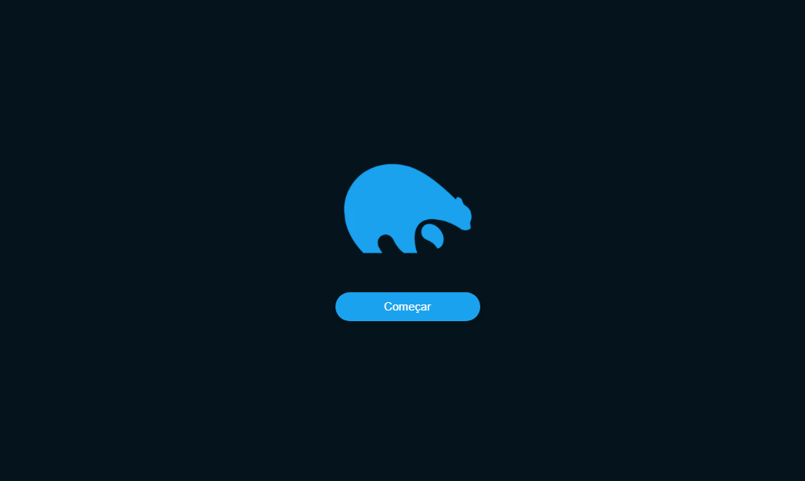

# MicroBlog FrontEnd
<div align="center">

</div>

</br>

### Esse site foi desenvolvido como processo seletivo para vaga de desenvolvedor fullstack na empresa <a href="https://trapi.com.br">Trapi</a>

<br/>

> Status: Finalizado!

## 🧪 Technologies:

+ Next JS
+ TypeScript
+ Tailwind CSS

## ✨ Como usar:

+ Faça o clone do projeto
+ Ao abrir a pasta do arquivo rode ```npm install``` ou ```yarn install```
+ Faça o clone da api: https://github.com/JuanLima10/Microblog-Backend.git
+ Vá em "api.ts" na pasta src/pages/api e coloque a URL em que a api está sendo executada
+ Inicie o projeto com ```yarn dev```

## 🧾 My Contacts:

* Linkedin: <a href="https://www.linkedin.com/in/juan-lima-297b9a1b4/">https://www.linkedin.com/in/juan-lima-297b9a1b4/</a> ;
* Email: <a href="malito:juanaraujolima17@gmail.com">juanaraujolima17@gmail.com</a> ;
* Site: <a href="https://juanlima10.github.io/meuPort/">https://juanlima10.github.io/meuPort/</a>
